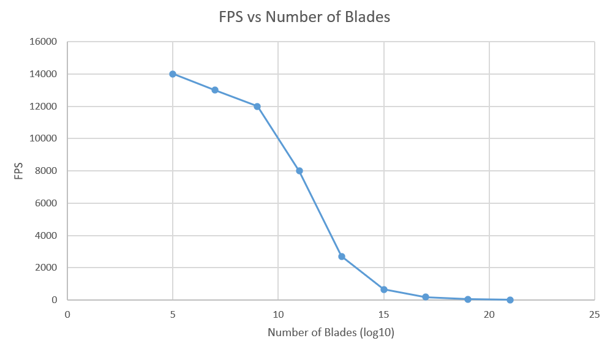

Vulkan Grass Rendering
==================================

**University of Pennsylvania, CIS 565: GPU Programming and Architecture, Project 5**

* Tianhong Zhou
  * [LinkedIn](https://www.linkedin.com/in/tianhong-zhou-b559aa159/)
* Tested on: Windows 11, i9-13950HX @ 2.20GHz, 32GB RAM, NVIDIA GeForce RTX 4060 Laptop GPU 8GB (Personal Laptop)

### GIF of project

Base grass without forces

Grass with forces

Orientation culling

Distance culling

### Description

This project implements Vulkan Grass Rendering, based on [Responsive Real-Time Grass Rendering for General 3D Scenes](https://www.cg.tuwien.ac.at/research/publications/2017/JAHRMANN-2017-RRTG/JAHRMANN-2017-RRTG-draft.pdf).

#### Representing Grass as Bezier Curves

In this project, grass blades are represented as Bezier curves. Each Bezier curve has three control points and some parameters like width and height. The Bezier Curves are tessellated in the tessellation shaders.

#### Simulating Forces

This project simulate three different forces, including gravity, recovery and wind. The total force is calculated by adding these three forces together.

#### Culling tests

This project implemented three culling methods:
- Orientation culling: Calculate the angle between front face direction of the grass blade and view vector and then cull the blades according to the angles.
- View-Frustum culling: Cull blades that are outside of the view-frustum.
- Distance culling: Cull blades that at large distances and smaller than the size of a pixel.

#### LOD

This project also implements a dynamic level-of-detail. Further grass blades are tessellated to lower vertices.

### Performance Analysis

#### Varying Numbers of grass blades

This nonlinear degradation suggests that performance bottlenecks arise primarily from the vertex and tessellation stages of the graphics pipeline. Each additional blade contributes significantly to the total vertex processing cost, and when combined with tessellation and shading, the GPU quickly becomes fill-rate and geometry-bound. Additionally, if each blade is rendered through separate draw calls or with limited instancing, the CPU-side overhead of command submission may further exacerbate the performance drop.

#### Orientation Culling

Tested on number of blades = 10^17

| Without | With |
|---|---|
| 190 FPS | 580 FPS|

Enabling orientation culling significantly improves performance, increasing FPS from 190 to 580. This indicates that a large number of back-facing or nearly invisible blades are effectively discarded, reducing vertex and fragment processing load.

#### View-Frustum Culling

Tested on number of blades = 10^17

| Without | With |
|---|---|
| 190 FPS | 210 FPS|

View-frustum culling yields a modest improvement from 190 to 210 FPS. Since most blades likely remain within the camera's view at this scale, the optimization has limited effect on overall performance.

#### Distance Culling

Tested on number of blades = 10^17

| Without | With |
|---|---|
| 190 FPS | 380 FPS|

Distance culling provides a substantial gain from 190 to 380 FPS. By removing distant blades that contribute minimally to visual detail, the GPU workload is reduced while maintaining scene fidelity.

#### LOD

Tested on number of blades = 10^17

| Without | With |
|---|---|
| 190 FPS | 300 FPS|

Applying LOD increases FPS from 190 to 300. Lower-resolution representations for distant blades decrease vertex complexity, improving efficiency without significantly affecting visual quality.

### CMakeLists Modification

Change cmake minimum required version from 2.8.12 to cmake_minimum_required(VERSION 4.1) for both ./CMakeLists.txt and ./externel/GLFW/CMakeLists.txt

In ./externel/GLFW/CMakeLists.txt, change cmake_policy(SET CMP0042 OLD) to cmake_policy(SET CMP0042 NEW)